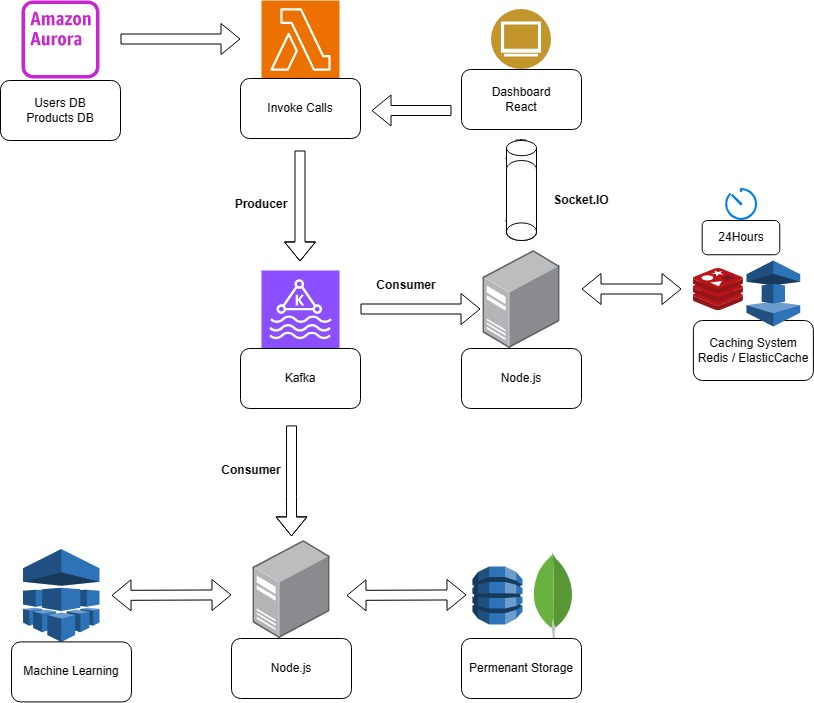

# Call Center Cloud

## Overview

This repository contains code for a cloud-based call center application, focusing on user generation, dashboard management, and server-side operations.

## System Design

## Key features
- Use a Lambda function to access a SQL user database and randomly generate 100 fake calls
- Intercept the calls, store them in mongoDB and create a 24 hours cache storage
- Pull data from Redis and present it in a React front dashboard application
- Present in the dashboard registered users.

## End points:
- Generate calls: POST("https://jwqt86dxpd.execute-api.us-west-1.amazonaws.com/dev/api/generate-calls")
- Backend server: https://call-center-server.onrender.com
- Front: Coming soon.

## Directories

- **lambda-call-generator**: Handles the generation of user data, with a limit set to 100 users. Useful for simulating call center activities.

- **material-dashboard-react**: Updates and manages the dashboard layout and data table components. This directory likely contains the front-end elements of the application, employing a React framework.

- **server**: Contains server-side code, including Redis key manipulation. This indicates the use of Redis for database management and data caching.

 

## Getting Started

To get started with this project:

1. Clone the repository.

2. Navigate to each directory and follow the specific setup instructions (if available).

 

## Contribution

Feel free to contribute to this project by submitting pull requests or opening issues for any bugs or feature requests.
